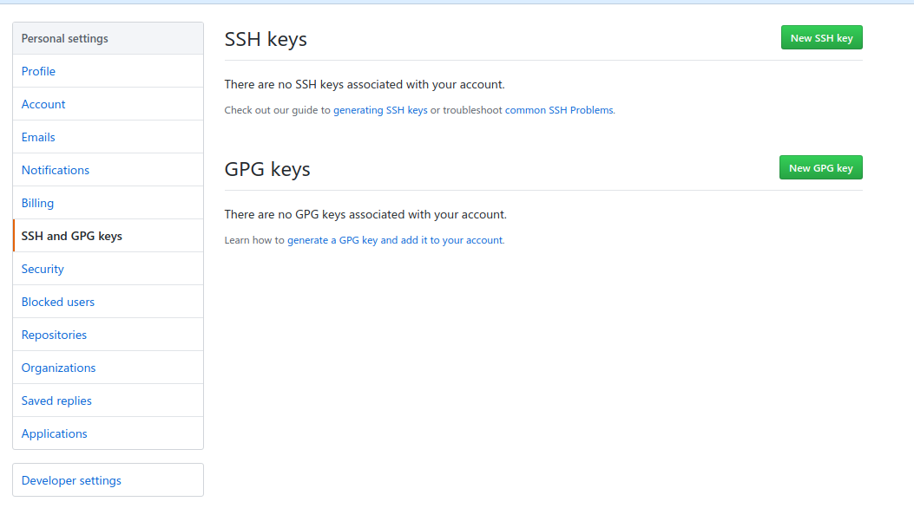
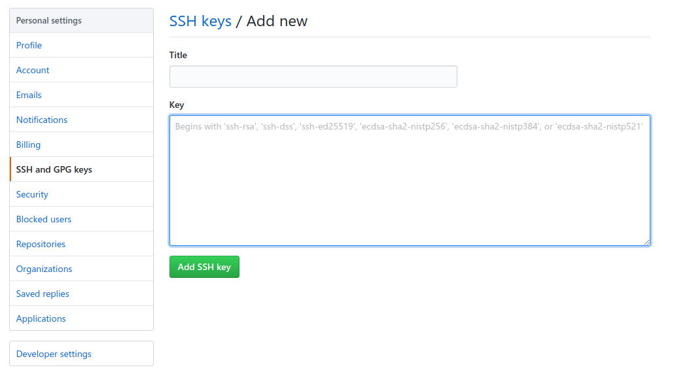

# GitHub-Skills

[TOC]

## 1.Git 常用命令总结

## 2.如何配置Linux Shell提交代码时默认用户和密码？

(1)检查本地用户home目录下是否以Github的用户（注意：可能以PC主机用户生成过，但是不能用作Git）生成过ssh的key，如果有则直接下一步，如果没有则执行下面的命令，为了防止覆盖以前的`id_rsa、id_rsa.pub`，这里指定在`~/.ssh` 目录下生成`github、github.pub`文件(私钥和公钥)：

`ssh-keygen -t rsa -f ~/.ssh/github -C jianghui_galaxy@163.com` （输入三次回车）

`ssh-add ~/.ssh/github`

(2)把公钥 `github.pub` 文件的内容添加到 Github:  `点击头像 ---> Settings ---> SSH and GPG keys ---> New SSH keys`, 写好Title，然后把上面生成的id_rsa.pub内容复制到Key下面的输入框中

`cat ~/.ssh/github.pub`

 

 

(3)查看本地和远程主机的连接是https还是ssh：

`git remote -v`

如果是ssh，结果：

`origin	git@github.com:jianghui-galaxy/GitHub-Skills.git (fetch)`
`origin	git@github.com:jianghui-galaxy/GitHub-Skills.git (push)`

如果是https，结果：

`origin	https://github.com/jianghui-galaxy/GitHub-Skills.git (fetch)`
`origin	https://github.com/jianghui-galaxy/GitHub-Skills.git (push)`

如果本地和远程主机的连接是https的，那么需要通过如下命令修改为ssh，注意这里的项目替换成自己的

`git remote set-url origin git@github.com:jianghui-galaxy/GitHub-Skills.git` 

(4)测试ssh连接是否正常

 `ssh -T git@github.com`

如果ssh连接正常输出：

`Hi jianghui-galaxy! You've successfully authenticated, but GitHub does not provide shell access.`

如果ssh不能连接输出：

`Permission denied (publickey).`

(5)提交试试是否需要用户名和密码

git

